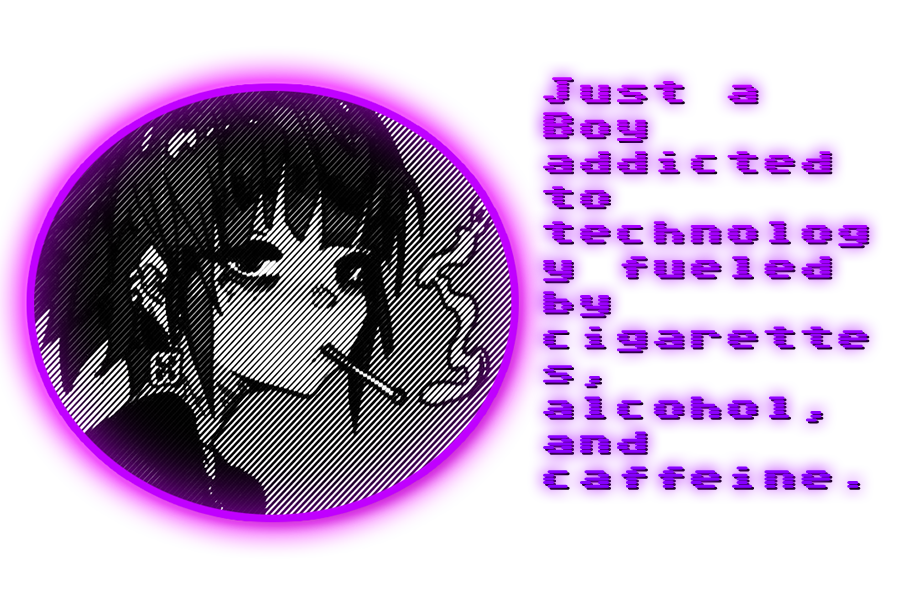

# Eu sou o fatalsec!

💻 Sou **estudante de tecnologia**, focado em entender **como as coisas funcionam por dentro**  
🔐 Tenho grande interesse em **hacking ético e segurança da informação**  
⚙️ Também estudo **desenvolvimento e automação**

☕ = Combustível

# Social
("https://x.com/fatalsecarchon") ("https://www.youtube.com/@fatalsecarchon") ("https://t.me/fatalsec") (https%3A%2F%2Finstagram.com%2Ffatalsec) (https://steamcommunity.com/profiles/76561199487005933/)
#
(https://livepix.gg/fatallartes)
#

# Brazuka undernet (Comunidade)

(https%3A//https%3A//t.me/brazuka_undernet))
(https%3A//t.me/%2BZtl-C31hGSEzNjAx)

# SKILLS & HACKING STACK
## Web / Frontend

# Hacking & Segurança da Informação
### Defensiva

### Ofensivo
-100000?style=for-the-badge&logo=redhat&logoColor=eb5e78&labelColor=2b2b2b&color=eb5e78)

-100000?style=for-the-badge&logo=redhat&logoColor=eb5e78&labelColor=2b2b2b&color=eb5e78)

### Mentalidade

# Desenvolvimento & Automação
## Tenho interesse em usar código para automatizar tarefas e criar soluções práticas.
- Automação de tarefas repetitivas
- Scripts utilitários
- Criação de landing pages
- Desenvolvimento backend básico
- Integrações simples
- Ferramentas para produtividade
#
#
#
#
#

